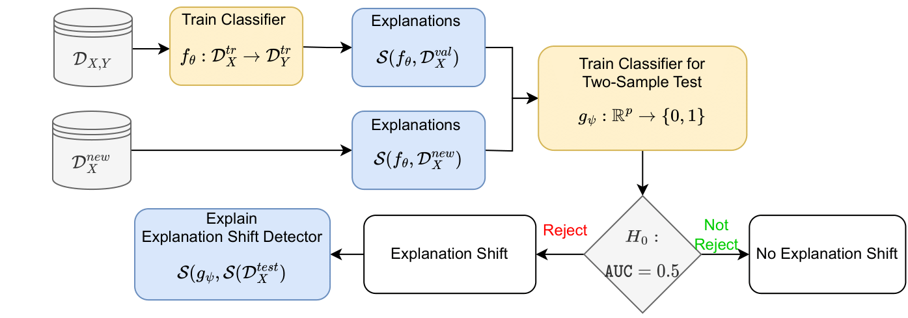
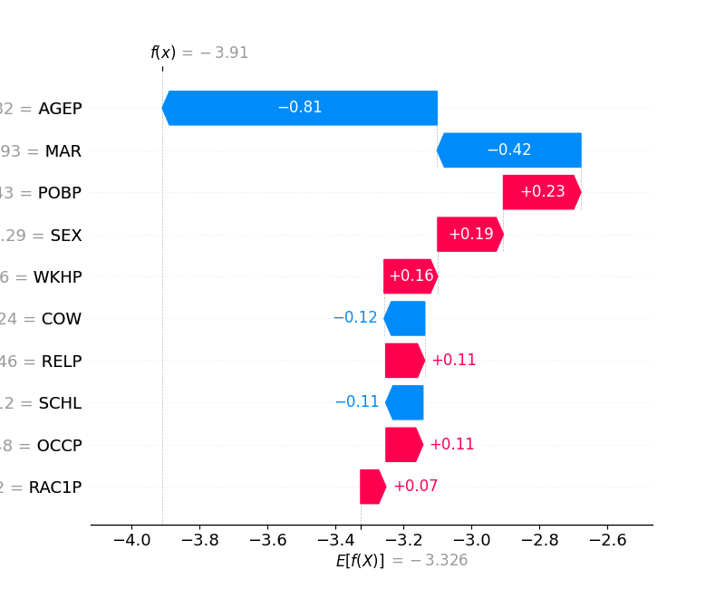
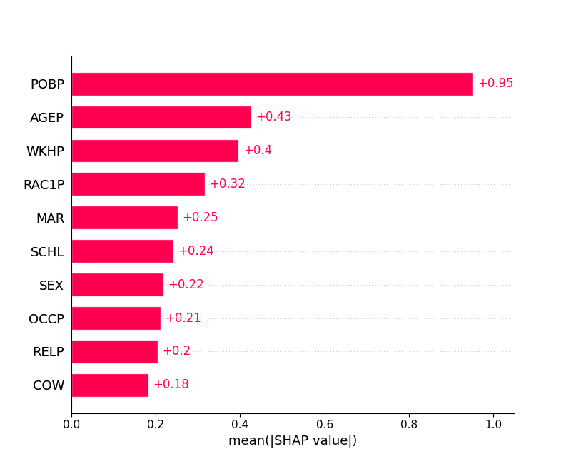

# Explanation Shift
## How Did the Distribution Shift Impact the Model?
**Abstract**
The performance of machine learning models on new data is critical for their success in real-world applications. However, the model's performance may deteriorate if the new data is sampled from a different distribution than the training data. Current methods to detect shifts in the input or output data distributions have limitations in identifying model behavior changes. In this paper, we define \emph{explanation shift} as the statistical comparison between how predictions from training data are explained and how predictions on new data are explained. We propose explanation shift as a key indicator to investigate the interaction between distribution shifts and learned models.  We introduce an Explanation Shift Detector that operates on the explanation distributions, providing more sensitive and explainable changes in interactions between distribution shifts and learned models. We compare explanation shifts with other methods based on distribution shifts, showing that monitoring for explanation shifts results in more sensitive indicators for varying model behavior. We provide theoretical and experimental evidence and demonstrate the effectiveness of our approach on synthetic and real data. Additionally, we release an open-source Python package, \texttt{skshift}, which implements our method and provides usage tutorials for further reproducibility.
<p align="center">
  
</p>


## Experiments
The experimental section is divided into two main parts. Experiments with synthetic data and experiments using the folks datasets.

### Synthetic Data Experiments

- Sensitivity to Multicovariate Shift `synthetic/gaussianShift.py`
- Posterior distribution shift `synthetic/posteriorShift.py`
- Shift on Uninformative features `synthetic/gaussianShiftRandom.py`
- Multicovariate Shift Test  `synthetic/gaussianShiftstats.py`


### Experiments on folks dataset
- `xaiExp.py` Produces the images on the paper. If added the argument ACSIncome, ACSEmployment ... Changes the prediction task.
- `NewCategory.py` Novel covariate group. If added the argument ACSIncome, ACSEmployment ... Changes the prediction task.

## How it works


```python
from sklearn.model_selection import train_test_split
from sklearn.datasets import make_blobs
from skshift import ExplanationShiftDetector
from xgboost import XGBClassifier
from sklearn.linear_model import LogisticRegression
from sklearn.metrics import roc_auc_score
import numpy as np
```


Let's generate synthetic ID and OOD data and split it into train, hold and test sets to avoid overfitting.

```python
# Create train, hold and test ID data
X, y = make_blobs(n_samples=2000, centers=2, n_features=5, random_state=0)
X_tr, X_te, y_tr, y_te = train_test_split(X, y, test_size=0.5, random_state=0)
X_hold, y_hold = make_blobs(n_samples=2000, centers=2, n_features=5, random_state=0)

# Create OOD data
X_ood, _ = make_blobs(n_samples=500, centers=1, n_features=5, random_state=0)
X_ood_te, y_ood_te = make_blobs(n_samples=500, centers=1, n_features=5, random_state=1)

# Concatenate Distributions
y_te = np.zeros_like(y_te)
y_ood_te = np.ones_like(y_ood_te)
X_new = np.concatenate([X_te, X_ood_te])
y_new = np.concatenate([y_te, y_ood_te])
```

Now there is two training options that are equivalent, 
either passing a trained model and just training the Explanation Shift Detector.

Fit Explanation Shift Detector where the classifier is a Gradient Boosting Decision Tree and the Detector a logistic regression. Any other classifier or detector can be used.

```python
# Option 1: fit the detector when there is a trained model
model = XGBClassifier().fit(X_tr, y_tr)

detector = ExplanationShiftDetector(model=model, gmodel=LogisticRegression())

detector.fit_detector(X_te, X_ood)
roc_auc_score(y_new, detector.predict_proba(X_new)[:, 1])
# 0.7424999999999999
```

Or fit the whole pipeline without previous retraining.
If the AUC is above 0.5 then we can expect and change on the model predictions.
```python
# Option 2: fit the whole pipeline of model and detector at once
detector.fit_pipeline(X_tr, y_tr, X_te, X_ood)

roc_auc_score(y_new, detector.predict_proba(X_new)[:, 1])
# 0.7424999999999999
```
## Experiments on Folks Dataset
Folktables: US Income Dataset
------------------------------------

In this case we use the US Income dataset. 
The dataset is available in the `Folktables <https://github.com/socialfoundations/folktables>`_ repository.

We generate a geopolitical shift by training on California data and evaluating on other states.

```python
from folktables import ACSDataSource, ACSIncome
import pandas as pd

data_source = ACSDataSource(survey_year="2018", horizon="1-Year", survey="person")
ca_data = data_source.get_data(states=["CA"], download=True)
pr_data = data_source.get_data(states=["PR"], download=True)
ca_features, ca_labels, _ = ACSIncome.df_to_pandas(ca_data)
pr_features, pr_labels, _ = ACSIncome.df_to_pandas(pr_data)

# Split ID data and OOD train and test data
X_tr, X_te, y_tr, y_te = train_test_split(
    ca_features, ca_labels, test_size=0.5, random_state=0
)
X_ood_tr, X_ood_te, y_ood_tr, y_ood_te = train_test_split(
    pr_features, pr_labels, test_size=0.5, random_state=0
)
X_new = pd.concat([X_te, X_ood_te])
y_new = np.concatenate([np.zeros_like(y_te), np.ones_like(y_ood_te)])

# Fit the model
model = XGBClassifier().fit(X_tr, y_tr)
```

The model is trained on CA data, and evaluated on data with OOD

```python
detector = ExplanationShiftDetector(model=model, gmodel=XGBClassifier())
detector.fit_detector(X_te, X_ood_te)
roc_auc_score(y_new, detector.predict_proba(X_new)[:, 1])
# 0.96
```
The AUC is high which means that the model is changing. We can now proceed to inspect the model behaviour change.

```python
explainer = shap.Explainer(detector.detector)
shap_values = explainer(detector.get_explanations(X_new))

# Local Explanations for instance 0
shap.waterfall_plot(shap_values[0])

# Global Explanations
fig = shap.plots.bar(shap_values)
```

We proceed to the explanations of the *Explanation Shift Detector*

<p align="center">
  
</p>

Above local explanations, below global explanations

<p align="center">
  
</p>

