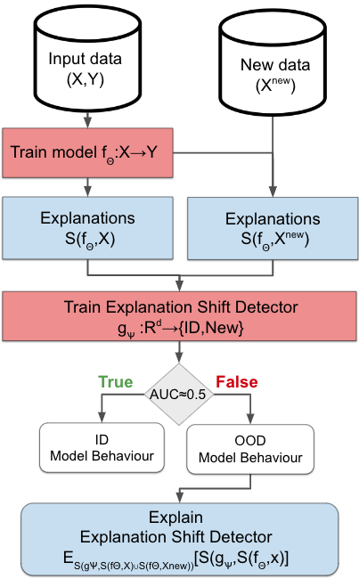

# Explanation Shift
## Investigating Interactions between Models and Shifting Data Distributions
**Abstract**
As input data distributions evolve, the predictive performance of machine learning models tends to deteriorate.
In practice, new input data tend to come without target labels. Then, state-of-the-art techniques model input data distributions or model prediction distributions and try to understand issues regarding the interactions between learned models and shifting distributions.
We suggest a novel approach that  models how explanation characteristics shift when affected by distribution shifts.
We find that the modeling of explanation shifts can be a better indicator for detecting out-of-distribution model behaviour than state-of-the-art techniques.
We  analyze different types of distribution shifts using synthetic examples and real-world data sets. We provide an algorithmic method that allows us to inspect the interaction between data set features and learned models and compare them to the state-of-the-art. We release our methods in an open-source Python package, as well as the code used to reproduce our experiments

<p align="center">
  
</p>


## Experiments
The experimental section is divided into two main parts. Experiments with synthetic data and experiments using the folks datasets.

### Synthetic Data Experiments

- Sensitivity to Multicovariate Shift `synthetic/gaussianShift.py`
- Posterior distribution shift `synthetic/posteriorShift.py`
- Shift on Uninformative features `synthetic/gaussianShiftRandom.py`
- Multicovariate Shift Test  `synthetic/gaussianShiftstats.py`


### Experiments on folks dataset
- `xaiExp.py` Produces the images on the paper. If added the argument ACSIncome, ACSEmployment ... Changes the prediction task.

## How it works
Importing libraries
```python
from sklearn.datasets import make_blobs
from xgboost import XGBRegressor
from sklearn.linear_model import LogisticRegression
from nobias import ExplanationShiftDetector
```

Synthetic ID and OOD data.
```python
X, y = make_blobs(n_samples=2000, centers=2, n_features=5, random_state=0)
X_ood, _ = make_blobs(n_samples=1000, centers=1, n_features=5, random_state=0)
```

Fit Explanation Shift Detector where the classifier is a Gradient Boosting Decision Tree and the Detector a logistic regression
```python
detector = ExplanationShiftDetector(model=XGBRegressor(), gmodel=LogisticRegression())

detector.fit(X, y,X_ood)
```
If the AUC is above 0.5 then we can expect and change on the model predictions.
```python
detector.get_auc_val()
# 0.70
```
